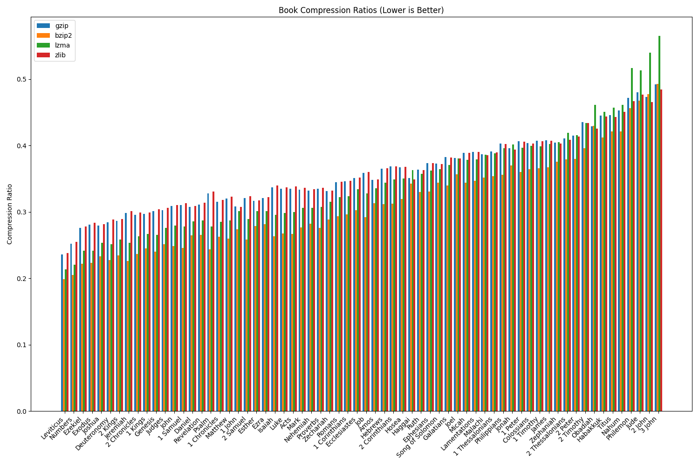

# Bible Compression Analysis



An offhand comment in a Sunday conversation prompted this line of thought. The result is rather cool!

## Usage

I uploaded the data from the ESV analysis here, but not the original text as I don't want to break Crossway's copyright. However, I can direct you to [this website](https://www.ph4.org/b4_poisk.php?text=esv&abbr=0) to download the ESV text and do this yourself. Just save it as `bible.xml`. Or download another translation and do some fun comparisons!

Just run

```sh
python3 main.py
```

and follow the prompts.

Enjoy!
